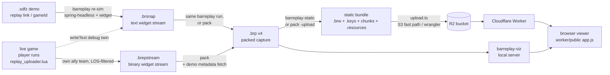

# barreplay

A Go tool that turns a **Beyond All Reason** (BAR) replay link into on-disk
**snapshots** of game state (unit positions, types, teams, health, and lifecycle
events), sampled periodically throughout the match.

It works by **re-simulating** the replay in the Recoil (Spring) engine headlessly.
A BAR replay (`.sdfz`) only stores the deterministic input stream — not unit
positions — so the only way to recover positions is to replay it in the engine and
sample state from inside via a small read-only Lua widget.

A companion tool, **`barreplay-viz`**, serves a browser UI that scrubs back and
forth through the captured data (unit positions/teams/health on a top-down map).
See [Visualizing a capture](#visualizing-a-capture) below.

## Pipeline

```
replay link / gameId / local .sdfz
        │
        ▼  internal/barapi      resolve gameId → metadata, download .sdfz from OVH storage
        ▼  internal/demofile    gunzip + parse header & startscript (engine/game/map/gameId)
        ▼  internal/engine      locate spring-headless, provision content, inject widget, launch
        ▼  assets/lua           snapshot_widget.lua samples units each N frames → writes BRSNAP lines to <gameId>.brsnap
        ▼  internal/capture     parse the BRSNAP file → snapshot records
        ▼  snapshot             pluggable Writer persists them (.brp compact binary)
```

### Format flows

Every capture, whatever its origin, converges on the packed `.brp` — the **only**
format the viewer is served (as the v4 wire pieces: `.brw` head + `.keys` +
chunks + `.resources`):



Not on the diagram on purpose: the parked TypeScript `.brepstream` splitter
(`worker/src/breps/split.ts`) can slice a raw stream into version-5 wire pieces
without transcoding, but the viewer deliberately rejects those (~1.4×+ larger
than v4) — it exists only as the parsing foundation for a future in-worker
`.brepstream → v4` transcoder.

### Package layout

| Package | Responsibility |
| --- | --- |
| `snapshot/` | **Public data model + pluggable `Writer`.** Owns the on-disk format. The format is `.brp` (currently version 4), a delta-coded columnar binary ~60x smaller than the retired v1 JSONL. |
| `internal/barapi` | Resolve a gameId/URL via `api.bar-rts.com` and download the `.sdfz` from the OVH bucket. |
| `internal/demofile` | Parse the `.sdfz` header (byte-packed, little-endian) and the embedded TDF startscript. |
| `internal/engine` | Locate `spring-headless`/`pr-downloader`, provision missing content, write the widget (with its output-file path), build the playback startscript, launch the engine. |
| `internal/capture` | Parse the widget's `BRSNAP` output file into `snapshot` records. |
| `internal/viz` | Serve the browser playback UI over a dir of `.brp` captures, and pack captures into static-hosting bundles. The SPA itself lives in `worker/` (one copy, embedded into the Go binary). |
| `worker/` | Cloudflare Worker (Hono + Vite) hosting the viewer as **static files from R2** — and the home of the front-end (`worker/public`, `worker/index.html`). |
| `assets/lua` | The embedded, read-only Lua widget injected into the engine's write-dir. |

## Build

```sh
go build ./cmd/barreplay        # the capture CLI
go build ./cmd/barreplay-viz    # the visualization server
go build ./cmd/pack   # converter: raw .brsnap/.brepstream -> .brp
go build ./cmd/barreplay-static # pack .brp captures into a static-hosting bundle (see worker/)
go test ./...
```

## Usage

```
barreplay [flags] <replay-link | gameId | path.sdfz>
```

Key flags:

| Flag | Meaning |
| --- | --- |
| `-data <dir>` | BAR/Spring data directory (`engine/`, `games/`, `maps/`); also the engine `--write-dir`. Required to run the engine. (`$BAR_DATA_DIR` also works.) |
| `-out <dir>` | Output directory for snapshot files (default `./snapshots`). |
| `-every <frames>` | Sampling interval in sim frames (30 = 1 Hz, the default). |
| `-engine <path>` | Path to `spring-headless` (overrides auto-location under `-data/engine/`). |
| `-no-provision` | Assume engine/game/map are already installed; skip `pr-downloader`. |
| `-force-provision` | Re-run `pr-downloader` even for content already recorded as provisioned (see below). |
| `-game` / `-map` | Override the `pr-downloader` game/map identifiers (the rapid-tag mapping is best-effort). |
| `-rapid-repo <url>` | Override the `pr-downloader` rapid master repo (default: BAR's repo). |
| `-progress` | Poll `<data>/infolog.txt` every 2s and print replay progress: current/total frame, in-game time / total, % complete, ETA, and processing speed (sim frames/sec and speed-up vs realtime, e.g. 45 fps = 1.5x). |
| `-no-run` | Download + parse only; don't launch the engine (useful for inspecting metadata). |

### Examples

Inspect a replay's metadata without running anything:

```sh
barreplay -no-run https://www.beyondallreason.info/replays?gameId=836d486a5480a9e830be54db7d2c7be9
# demo: gameId=836d486a... engine=2025.06.24 map="Isidis crack 1.1" game="Beyond All Reason test-30541-..." gameTime=720s
```

Full capture (requires a BAR install / engine — see below); `-progress` streams live
status and the run prints a summary when it finishes:

```sh
barreplay -progress -data ~/.local/share/Beyond-All-Reason/data -out ./snaps \
    https://www.beyondallreason.info/replays?gameId=836d486a5480a9e830be54db7d2c7be9
# progress: frame 2700/5790  •  01:30 / 03:13 game (46.6%)  •  512 sim-fps (17.1x)  •  ETA 00:12
# ...
# done: wrote snaps/836d486a...brp
#   engine simulation took 12.847s
#   infolog.txt: 45.20 MB
#   snapshot: 0.15 MB
```

## Output format (`.brp` compact binary, version 4)

The default output is `.brp` — a sectioned, gzip-compressed columnar binary owned
by `snapshot/brp.go` and specified byte-for-byte in
[`docs/brp-format.md`](./docs/brp-format.md) (the measured evaluation behind its
design decisions is in [`docs/brp-optimizations.md`](./docs/brp-optimizations.md)).
Unit state barely changes between 1 Hz samples, so a frame stores only the units
that **changed** (plus an explicit dead list): a changed unit's values are deltas
against its previous sample (positions additionally predicted by the unit's own
velocity, so constant-velocity movement costs nothing), zigzag-varint encoded
column by column, then gzipped; every unchanged unit — about two thirds of all
records in a real game — costs zero bytes, and the decoder re-materializes it by
dead reckoning. Unit elevation (y) is not stored at all: the viewer renders the
x/z plane, and a ground unit's height is implied by the terrain. On a real
~33-minute 8v8 game (4.2M unit records) this is **~8 MB where the retired v1 JSONL format was
476 MB (~60x)**, with no other loss beyond fixed quantization (whole elmos/hp,
velocity per sample interval, build progress 1/255, resources 0.1).

Frames are grouped into **chunks of 64 samples** (~1 minute of game each), with
the codec's prediction state reset at every chunk boundary — the video-codec
model. Every chunk's first frame (its **keyframe**, fully absolute) lives
outside the chunks, in a dedicated section holding all keyframes as **one gzip
stream**; chunks carry only the remaining delta frames. That is what makes the
viewer start instantly and the whole timeline scrubbable within seconds: it
downloads the keyframes section first (one request, decoded progressively while
it streams), then fills in delta chunks around the playhead — and no byte is
ever fetched twice.

A `.brp` holds everything the old JSONL format did except unit elevation: full meta
(unit-def table, teams, players), per-unit position/velocity/health/build
progress, per-team economy, and lifecycle events, plus precomputed bounds so
the viewer doesn't scan frames. Read it back with `snapshot.ReadBRP` (or one
chunk at a time via `snapshot.ParseBRP` + `DecodeChunk`). The keyframes section
and each chunk are independently compressed **on purpose**: any server —
`barreplay-viz`, or a dumb static host like R2 (see `worker/`) — hands them to
the browser byte-for-byte (no server-side re-encoding), and the browser gunzips
them natively.

Raw widget streams convert without re-running the simulation:

```sh
pack ./caps/*.brsnap        # writes <gameId>.brp next to each input
pack ./caps/*.brepstream    # the binary widget stream works the same way
```

A raw `.brsnap` is just the widget's stream — it has no map name, versions, or
player roster (those live in the demo the capture replayed). To still produce a
**full** `.brp` without re-running the simulation, `pack` takes the
replay's gameId from the input's file name (the pipeline names streams
`<gameId>.brsnap`; use `-id <gameId|link>` if yours is named differently),
downloads the demo from the BAR API, and seeds its startscript metadata exactly
like a capture run does. `-no-demo` skips the download (offline) at the cost of
that metadata; the sampling interval is inferred from the stream's frame
spacing either way.

`-upload r2` additionally uploads the packed `.brp`'s static bundle to the worker's
R2 bucket (via the worker project in `-worker-dir`, default `./worker`) — the replay
appears in the deployed viewer immediately, no redeploy needed. `-upload local`
targets the local `npm run dev` simulator instead. Every input — including a raw
`.brepstream` — is converted to `.brp` first: the viewer serves only the `.brp` wire
format (it is the most compact encoding of the pieces it downloads).

To change the persisted format, implement `snapshot.Writer` — nothing else changes.

## Visualizing a capture

`barreplay-viz` serves an interactive, browser-based playback of a capture. It is a
separate, **read-only** tool: it never launches the engine — it only reads finished
snapshot files.

```sh
go build ./cmd/barreplay-viz
./barreplay-viz -snapshots ./snapshots      # then open http://127.0.0.1:8080
```

| Flag | Meaning |
| --- | --- |
| `-snapshots <dir>` | Directory of snapshot files to browse (default `./snapshots`). |
| `-addr <host:port>` | Listen address (default `127.0.0.1:8080`). |

It lists every `.brp` file in the directory in a picker (**only the current `.brp`
version is supported**; convert a raw `.brsnap`/`.brepstream` once with
`pack`, and regenerate any pre-v4 `.brp` the same way). The replay
**streams, keyframes first**: the viewer fetches a small head (metadata, teams,
icons, events, chunk index), then the keyframes stream — every minute's keyframe,
one download, decoded progressively as it arrives — and then chunk-sized pieces of
delta frame data around the playhead while the rest downloads in the background.
Playback starts in under a second even on a slow connection, and within a few
seconds the **whole timeline is scrubbable**: dragging it across regions whose
chunks haven't downloaded yet shows each minute's keyframe instantly. A bar under
the timeline shows keyframe-only vs fully-downloaded ranges, video-player style. The page renders each sampled frame as a
top-down map, colouring units by team (grouped by ally-team), with:

- the **real map terrain** behind the units (the browser loads it straight from the BAR
  maps API using the capture's map name, positioned in world space), toggled with the
  **Map** checkbox,
- **real BAR unit icons** (from vendored game assets), team-tinted and drawn at a
  constant screen size (per-type, like BAR's minimap — icons overlap when zoomed out and
  spread apart when zoomed in); toggle to plain dots with the **Icons** checkbox and adjust
  their size with the slider next to it (persisted in the URL as `?iconsize=`),
- **build footprints** for buildings — the terrain rectangle each structure occupies,
  drawn in world space (so it scales with zoom) and team-tinted; mobile units get none.
  Toggle with the **Footprints** checkbox. (The footprint size comes from the captured
  unit-def `xsize`/`zsize`, so only captures made after the unit-def dump was added carry it.)
- **Fit icons** (checkbox, default on): normally icons are a constant screen size, but when
  you zoom in far enough that a building's icon would reach 90% of its footprint, the icon
  grows with the footprint instead of staying tiny inside it. Mobile units are unaffected.
- a **timeline scrubber** + play/pause and a speed control (from **1× real time** up to 60×);
  playback **interpolates unit movement** between the 1 Hz samples using each unit's captured
  velocity, so units glide smoothly instead of blinking to the next position (stationary units
  stay put),
- **scroll to zoom, middle-drag to pan**, and a hover **tooltip** (unit name, team, position, health),
- a live **sidebar**: game time / sim frame / unit count, per-team unit counts, and a
  lifecycle **event feed** (created/finished/destroyed) up to the current frame.

The front-end is plain HTML/JS/Canvas — one copy for all deployments, living in
`worker/public` and embedded into the Go binary via `go:embed`. The server exposes
the same static-shaped URLs the R2/Cloudflare deployment serves (so the app can't
tell them apart): `/index.json` (the replay list), `/replays/<id>.brw` (one
capture's head: metadata + events + chunk index), `/replays/<id>.keys` (every
keyframe, one gzip stream), `/replays/<id>/c<n>` (one chunk's delta frames, sliced
byte-for-byte from the stored file — the browser decodes everything with its native
`DecompressionStream`, see `internal/viz/wire.go` and `snapshot/brp.go`),
`/replays/<id>.resources` (per-frame team economy), and `/icons/<file>` (the
vendored unit icons). For hosting the same viewer with **no server at all**, pack
captures with `barreplay-static` and serve the resulting file tree from any static
host — see [`worker/README.md`](./worker/README.md). The
icon set and BAR's `icontypes.lua` name→bitmap table are vendored under
`internal/viz/bardata/` (see its README); the mapping is parsed directly in Go,
so no Lua VM / third-party dependency is added. The map terrain is fetched by the
**browser directly** from the BAR maps API (`api.bar-rts.com`) using the capture's map
name — the viz server never proxies it; if the API is unreachable (or the capture has
no map name, e.g. one packed from a raw `.brsnap` with `-no-demo`) the viewer just
falls back to a plain background.

## Requirements for a real run

`barreplay` launches the engine; the host must therefore have:

- **`spring-headless`** matching the replay's engine version (e.g. `2025.06.24`).
  The version **must match** or the deterministic replay desyncs. It is typically at
  `<data>/engine/<version>/spring-headless`. If missing, build the `engine-headless`
  target from the matching RecoilEngine tag, or point `-engine` at a build.
- The **game archive** (the `gameVersion` from the demo) and the **map** under
  `<data>/games` and `<data>/maps`. Unless `-no-provision` is set, `barreplay` runs the
  bundled `pr-downloader` **pointed at BAR's rapid repo** (`repos.beyondallreason.dev`)
  to fetch whatever is missing — no manual `pr-downloader` steps needed. A replay pins
  one exact game build, so `barreplay` resolves the demo's game name to its precise
  `byar:git:<sha>` rapid tag (via BAR's `versions.gz` index, cached under
  `<data>/cache/`) and downloads *that* — using
  the moving `byar:test` tag would install the wrong build and the engine would abort
  with `content_error: Dependent archive … not found`. Provisioning is best-effort (it
  warns and continues if a fetch fails, since content may already be installed). Because
  `pr-downloader` re-queries (and can re-download) content on every call even when it is
  present, `barreplay` first checks the filesystem and skips the download when the content
  is already there (a rapid game's `packages/<md5>.sdp`, or a map archive in `maps/`); this
  is self-correcting — delete the content and it re-downloads. `-force-provision` forces the
  download anyway. Rapid
  pool downloads use `PRD_RAPID_USE_STREAMER=false` by default (the streamer is faster
  but stalls mid-pool on WSL/behind proxies, leaving a `.sdp.incomplete` the engine
  ignores — so the game would be reported "not found"); set it to `true` to opt back in.
  Use `-game`/`-map`/`-rapid-repo` to override identifiers, and set `PRD_SSL_CERT_FILE=<ca>`
  in the environment if you are behind a proxy (it is passed through to `pr-downloader`).
- **A working GL stack (GPU or full software GL) — see the next section.** Recoil's
  `spring-headless` (through at least engine `2025.06.24`) still initializes GL and
  builds a unit-icon render-to-texture atlas at load; on a GPU-less host it never
  finishes and the game never starts playing, so no snapshots are produced.

## Running on Linux / Windows / WSL

The engine, not this tool, is the constraint. Two facts drive the choice of engine:

1. **Engine version must match the replay** (or the re-sim desyncs), so you generally
   run the exact `spring-headless` the replay was recorded with.
2. **The pre-2026-04-12 `spring-headless` needs real GL.** The headless icon-atlas hang
   (`CreateAtlasTexture … atlasRendered=0` looping forever at frame `-1`) was a Recoil
   bug fixed on 2026-04-12 (*"do not run atlas/iconhandler in headless"*). Builds after
   that skip the atlas and run with **no GPU at all**; builds at/before it need GL.

Pick the row that matches your engine + host:

| Host | Engine | What to run |
| --- | --- | --- |
| **Windows** (native) | any, incl. old | `barreplay.exe` (`GOOS=windows go build ./cmd/barreplay`) against `spring-headless.exe`. Windows has a real GL driver, so the atlas completes — the most reliable route. |
| **Linux / WSL, no GPU** | **post-2026-04-12** | Just run it — `-engine` at that headless build; fully headless, no GPU/Xvfb. Only valid when the replay was recorded on a compatible engine. |
| **Linux / WSL, no GPU** | old (e.g. `2025.06.24`) | Headless will hang. Run the **graphical** binary instead: `-engine <data>/engine/<ver>/spring` under Xvfb + Mesa llvmpipe (`LIBGL_ALWAYS_SOFTWARE=1 GALLIUM_DRIVER=llvmpipe xvfb-run -a …`). Needs `libsdl2-2.0-0` + `libopenal1`; slow. |
| **WSL2 + WSLg + GPU** (Win11) | old | WSLg provides GPU GL (d3d12). Run the **graphical** `-engine <data>/engine/<ver>/spring`; BAR calls WSLg "too slow for the game", so prefer the Windows-native route. |

`-engine` accepts **any** engine binary (headless or graphical) — the tool just execs it
with `--isolation --write-dir <script>`, which both accept — so switching to the
graphical `spring`/`spring.exe` needs no code change, only the flag. See
[`CLAUDE.md`](./CLAUDE.md) for the full GPU/GL caveat and the source-level explanation.

### Manual end-to-end verification

On a machine with BAR installed:

```sh
go build ./cmd/barreplay
./barreplay -data <BAR data dir> -out ./snaps \
    https://www.beyondallreason.info/replays?gameId=836d486a5480a9e830be54db7d2c7be9
```

Expect: the `.sdfz` downloaded into `<data>/demos`, a fast run (the widget forces max
playback speed via `setmin/maxspeed` — add `-progress` to watch the speed-up), and
`./snaps/<gameId>.brp` with roughly `gameTime` sampled frames inside. On completion the
tool reports the engine simulation time, the `infolog.txt` size, and the snapshot's
size. Load it in `barreplay-viz` and spot-check that unit counts rise and fall
plausibly and that positions fall within the map bounds.

## Notes & known rough edges

- The widget forces `spectatorfullview 1` so `Spring.GetAllUnits()` returns every
  unit regardless of line-of-sight. It is strictly read-only (only `Get*` +
  `Spring.Echo`), so it cannot desync the replay.
- Dropping the widget into `<data>/LuaUI/Widgets/` with `enabled = true` is **not**
  enough: BAR only auto-runs a user widget already named in its saved order list, and
  a replay forces `allowuserwidgets = true`, which paradoxically skips the
  `enabled`-based auto-enable for fresh user widgets. So `barreplay` seeds
  `<data>/LuaUI/Config/BYAR.lua` to enable the widget, backing up and restoring your
  real widget config around the run. (A gadget would need engine dev-Lua to load from
  the write-dir, so a widget is the right mechanism.) `-engine`, `-no-provision`,
  `-game`, `-map`, and `-rapid-repo` are the escape hatches for install-specific setups.
- The transport from Lua to Go is a file of tagged `BRSNAP ...` lines that the widget
  writes with `io.open`, not stdout: the engine flushes its log on every `Spring.Echo` and
  caps each Echo at a few hundred units, so streaming through stdout was slow and truncated.
  Spring's LuaIO sandbox forbids absolute paths, so the widget writes a relative path inside
  the engine's write-dir (`<data>/barreplay/<gameId>.brsnap`); the tool reads it after the
  run and moves it to `<out>/<gameId>.brsnap`. `internal/capture` parses that file, isolating
  the transport so it can change without touching the `snapshot` format. The `.brsnap` file
  is the raw intermediate; the `.brp` is the final deliverable.
```
