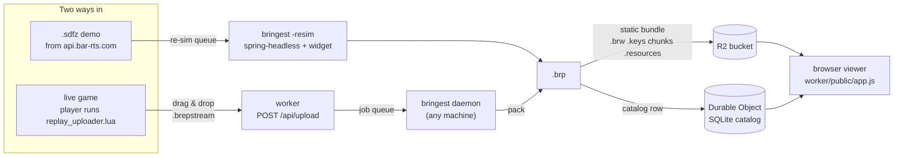

# barreplay

**Live site: <https://replay.fogofwar.dev>** — browse and play back captured
Beyond All Reason games. To record your own games, follow the
[widget install guide](https://replay.fogofwar.dev/setup).

barreplay recovers **unit positions** from Beyond All Reason (BAR) games and
plays them back in the browser: a top-down map with every unit, its health,
what it is building, the chat, the map drawings, scrubbable at any speed.

A BAR replay (`.sdfz`) does not contain positions. It stores only the players'
input stream, and the deterministic Recoil (Spring) engine recomputes everything
else. So there are exactly two ways to get positions, and this repo does both:

- **Re-simulate the replay** headlessly in `spring-headless` with a read-only
  Lua widget sampling game state once a second.
- **Record a live game** with the same widget installed by a player, who then
  drag-and-drops the capture onto the site.

Either way the result is a `.brp` file, a compact delta-coded binary the viewer
streams keyframes-first.

## How it works



**A live capture** starts with a player. The
[uploader widget](assets/lua/replay_uploader.lua) writes a binary
`.brepstream` of their own side of the game (plus whatever enemies they can
see) at 1 Hz. They drop it on the landing page; the worker archives it and
queues a job. `bringest`, a daemon polling the worker from any machine, packs it
into a `.brp`, fetches the demo's metadata (map, players, ranks, chat) from the
BAR API, uploads the pieces to R2, and registers the replay in the catalog.

**A re-simulation** starts with a game id. The worker mirrors BAR's public game
list every minute, so any game can be queued: pasted by an admin, or picked
automatically when a one-sided upload lands and the game wants a full
spectator view. A `bringest -resim` daemon on a machine with the engine
downloads the demo, provisions the exact engine and game build the replay pins,
injects the [snapshot widget](assets/lua/snapshot_widget.lua), runs the demo at
max speed, and publishes the result exactly like an upload.

**The viewer** never talks to a playback server. Every `.brp` is served as
independently-gzipped byte ranges from R2 through `cdn-bar.fogofwar.dev`: a
small head, then all keyframes as one stream (the whole timeline is scrubbable
in seconds), then delta chunks around the playhead. The map terrain and unit
icons are BAR's own. For local development the same front-end runs under
`npm run dev` in `worker/` against a simulated bucket fed by `pack -upload local`.

## Architecture

The Go side is stdlib-only. The worker is Hono + Vite on Cloudflare Workers
with a SQLite Durable Object and an R2 bucket. `CLAUDE.md` is the exhaustive
reference; this table is the map.

| Path | What it is |
| --- | --- |
| `cmd/barreplay` | CLI: one replay link in, one `.brp` out. Downloads, provisions, injects the widget, runs the engine. |
| `cmd/bringest` | The ingest daemon. Polls the worker's job queue; publishes drag-and-drop uploads, or with `-resim` re-simulates games headlessly. |
| `cmd/pack` | Convert a raw widget stream to `.brp`, print a size breakdown, publish to R2 and the catalog. |
| `cmd/barreplay-static` | Pack `.brp` files into a static-hosting bundle. |
| `snapshot/` | The data model and the `.brp` codec. Nothing else knows the on-disk format. |
| `internal/capture` | Parse the widgets' streams (`.brsnap` text, `.brepstream` binary) into snapshot records. |
| `internal/demofile` | Parse the `.sdfz` header, startscript, and the chat and map-drawing packets. |
| `internal/engine` | Locate or download `spring-headless`, provision content via `pr-downloader`, write the widget, launch and watch the engine, memory guard, ETA. |
| `internal/resim` | The re-simulation pipeline as one call, with live progress for the daemon. |
| `internal/packer` | Pack, upload (native SigV4 to R2), and register in the catalog. |
| `internal/barapi` | BAR's replay API and demo download. |
| `internal/viz` | The wire format served to the browser, the static bundle writer, the catalog row builder, BAR's unit icons. |
| `assets/lua` | The two widgets: the injected re-sim sampler and the player-installable live recorder. |
| `worker/` | The Cloudflare Worker: front-end (`worker/public`), catalog, job queue, games mirror, admin routes. See `worker/README.md`. |
| `patches/` | Engine patches for faster, leaner headless re-simulation. See below. |
| `docs/` | Byte-level format specs and the engine build recipe. |

Why a widget and not an engine change: widgets run in the unsynced Lua state,
read game state through `Spring.Get*`, and cannot desync the replay. The
sampler writes its stream to a file inside the engine's write-dir rather than
through `Spring.Echo`, which flushes the log on every call and truncates long
lines. Getting BAR to load a user widget in a replay is non-obvious; see
"Making BAR actually load the widget" in `CLAUDE.md`.

## Replay file format

Three formats, in order of appearance. Only the last is ever served.

**`.brepstream`** is what the live uploader widget writes: a binary
keyframe-plus-delta stream, spec in [`docs/brepstream-format.md`](docs/brepstream-format.md).
The re-sim widget writes the older tagged-text `.brsnap` (`BRSNAP F …`,
`BRSNAP U …`), which is the reference format for the binary encoder. Both
carry unit defs dumped in full, team and player preambles, per-unit position,
velocity, health and build progress, per-team economy, lifecycle events, and
since widget 1.6.0 chat and map drawings.

**`.brp`** (version 5) is the packed capture, owned by `snapshot/brp.go` and
specified byte for byte in [`docs/brp-format.md`](docs/brp-format.md), with the
measured design evaluation in [`docs/brp-optimizations.md`](docs/brp-optimizations.md).
A container of tagged sections: `M` meta JSON with a chunk index, `K` every
keyframe as one gzip stream, `F` delta-frame chunks, `X` team resources, `E`
events, `C` comms. Frames are grouped into chunks of 64 samples with the
predictor reset at every boundary, the video-codec model. A delta frame stores
only a dead-id list and the units whose columns differ from prediction;
positions predict from the previous velocity, so a unit moving at constant
speed costs zero bytes, and about two thirds of all unit records do. Changed
columns are zigzag-varint deltas against the unit's previous sample. Elevation
is not stored. A real 33-minute 8v8 is about 8 MB, where the original JSONL
format was 476 MB. The writer is deterministic: the same capture always
produces the same bytes, which is what the engine-patch verification relies on.

**The wire** is the `.brp` cut into static files the browser fetches directly:
`<id>.brw` (head: meta, teams, unit defs, icons, events, comms, chunk index),
`<id>.keys` (the `K` section verbatim), `<id>/c<n>` (one chunk's delta bytes
sliced from the file), `<id>.resources`. Nothing is re-encoded server-side; the
browser gunzips with `DecompressionStream`. Three decoders stay in lockstep:
the Go encoder and decoder in `snapshot/brp.go` and the JavaScript decoder in
`worker/public/app.js`.

## Engine patches

A headless re-simulation of a big game is an hour of somebody's machine and
several gigabytes of memory, and every improvement has to leave the produced
`.brp` byte-identical to the stock engine's. `patches/engine-<version>/`
holds the series that apply with `git am` onto that tag of
[RecoilEngine](https://github.com/beyond-all-reason/RecoilEngine); the build
recipe is [`docs/building-recoil.md`](docs/building-recoil.md).

The current series, for engine 2026.07.04, on a 16-player 30-minute game:

| Axis | Stock | Patched | Record |
| --- | --- | --- | --- |
| Sim wall time | 7m33s | 5m12s | [`RESULTS.md`](patches/engine-2026.07.04/RESULTS.md) |
| Engine load | 12s | 9s | same |
| Peak resident memory (16p, 13 min) | 5.4 GB | 3.9 GB | [`MEMORY.md`](patches/engine-2026.07.04/MEMORY.md) |

The big wins, none of them inside the simulation:

- **Unpaced demo playback.** The local game server paces packet release to
  hold client CPU at a fixed target, so the sim idled and the main loop spun
  draw passes. Releasing packets as fast as the client consumes them changes
  timing only, never content.
- **A coarse exit-only block grid** for the yardmap collision test, the single
  largest instruction cut.
- **Lazy zeroing of the static memory pools.** Recoil `memset`s 1.05 GiB of
  pre-zeroed `.bss` before `main`; zeroing only handed-out pages preserves the
  pool's invariant and saves about 1.1 GB resident on every run, including
  ordinary BAR clients.
- **Skipping `.smt` tile decode** and other draw-side work under `HEADLESS`.

`experiments/` under each version keeps every hypothesis tried, including the
rejected ones, with the benchmark tooling and a log of the method. Verdicts
were taken on a synced-instruction meter rather than wall time, because the
benchmark VM drifts by ten percent across hours.

`bringest -resim` prefers a patched `spring-headless-patched` beside the stock
binary when one exists and otherwise runs stock; nothing downloads patched
builds, and the capture cannot tell which build made it.

## Build and run

```sh
go build ./cmd/...
go test ./...
go vet ./... && gofmt -l .
```

Capture one replay (needs the engine, see below):

```sh
./barreplay -data <BARdata> -out ./snaps https://www.beyondallreason.info/replays?gameId=<id>
```

View captures locally (the worker's dev server over a simulated bucket):

```sh
cd worker && npm run dev                # http://127.0.0.1:5173
./pack -upload local ./snaps/<gameId>.brp
```

Pack a raw widget stream and publish it:

```sh
./pack ./caps/<gameId>.brepstream       # packs, fetches demo metadata, uploads, registers
./pack -upload= ./caps/<gameId>.brp     # size breakdown only, publishes nothing
```

Run the ingest daemon (reads `./.env` for `REPLAY_PUT_TOKEN` and R2 keys):

```sh
./bringest                              # publish drag-and-drop uploads
./bringest -resim -data <BARdata>       # re-simulate queued games
```

The worker deploys with `npm run deploy` from `worker/`, which runs the tests,
builds, smoke-tests the built worker, and deploys. `worker/README.md` has the
runbook, including the R2 CORS policy, the cache rule for the data hostname,
and the Cloudflare Access setup for the admin routes.

### Requirements for a real run

The engine is the constraint, not this tool.

- `spring-headless` **matching the replay's engine version exactly**. A
  mismatch desyncs silently, so `barreplay` refuses one. It downloads the
  release into `<BARdata>/engine/<version>/` when missing, which needs `7z` on
  the path.
- The game build and map the replay pins. `pr-downloader` fetches them from
  BAR's rapid repo, resolving the demo's game name to its exact
  `byar:git:<sha>` tag. Provisioning is idempotent and best-effort.
- Memory. A big 8v8 wants 5 to 8 GB resident. A memory guard stops the
  engine before the host runs out, which matters because a global OOM kill
  takes the whole systemd scope with it. See "Running out of memory" in
  `CLAUDE.md`.
- No GPU is needed on engine 2025.06.24 and later. `docs/building-recoil.md`
  has the validated GPU-less run.

One engine run per data dir: runs share widget config and the infolog, so
`barreplay` takes an advisory lock and a second concurrent run must use a
separate `-data`.

## Documentation

- [`docs/brp-format.md`](docs/brp-format.md), [`docs/brepstream-format.md`](docs/brepstream-format.md): byte-level specs.
- [`docs/brp-optimizations.md`](docs/brp-optimizations.md): the measured evaluation behind the codec.
- [`docs/building-recoil.md`](docs/building-recoil.md): building the engine at an exact tag.
- [`docs/widget-remote-upload.md`](docs/widget-remote-upload.md): the crowd-sourced capture design.
- [`worker/README.md`](worker/README.md): deploying and operating the site.
- `CLAUDE.md`: the full design record, with the reasoning behind every non-obvious decision.
